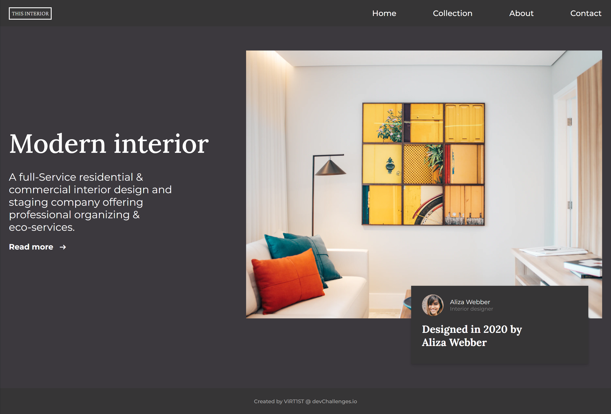

<!-- Please update value in the {}  -->

<h1 align="center">CHALLENGE #03: INTERIOR CONSULTANT</h1>   

   Solution for a challenge from  <a href="http://devchallenges.io" target="_blank">Devchallenges.io</a>.

  <h3>
    <a href="https://ViRT1ST.github.io/devchallenges-interior-consultant/">Demo</a>
     | 
    <a href="https://devchallenges.io/challenges/Jymh2b2FyebRTUljkNcb">Challenge</a>
  </h3>

<!-- TABLE OF CONTENTS -->

## Table of Contents

-   [Overview](#overview)
-   [Built With](#built-with)
-   [Features](#features)
-   [Acknowledgements](#acknowledgements)

<!-- OVERVIEW -->

## Overview

## Built With

<!-- This section should list any major frameworks that you built your project using. Here are a few examples.-->

-   HTML
-   CSS
-   BEM
-   JS

## Features

<!-- List the features of your application or follow the template. Don't share the figma file here :) -->
This application/site was created as a submission to a [DevChallenges](https://devchallenges.io/challenges) challenge. 

## Acknowledgements

-   Google Fonts
-   Visual Studio Code
